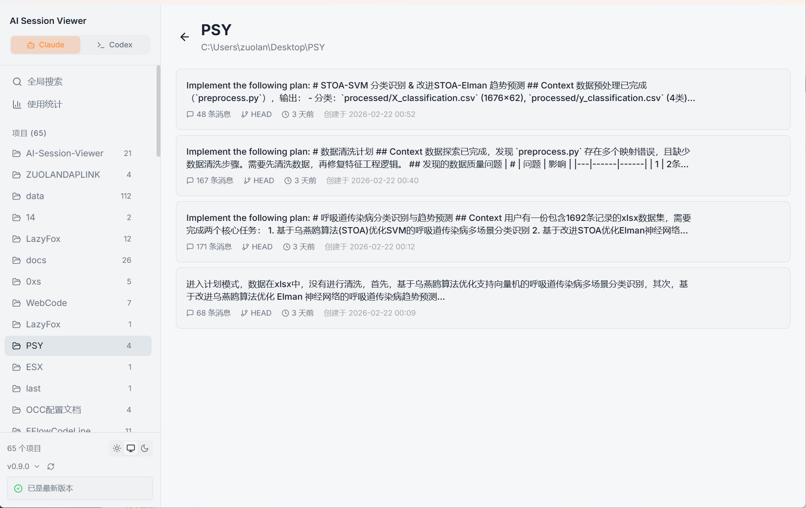
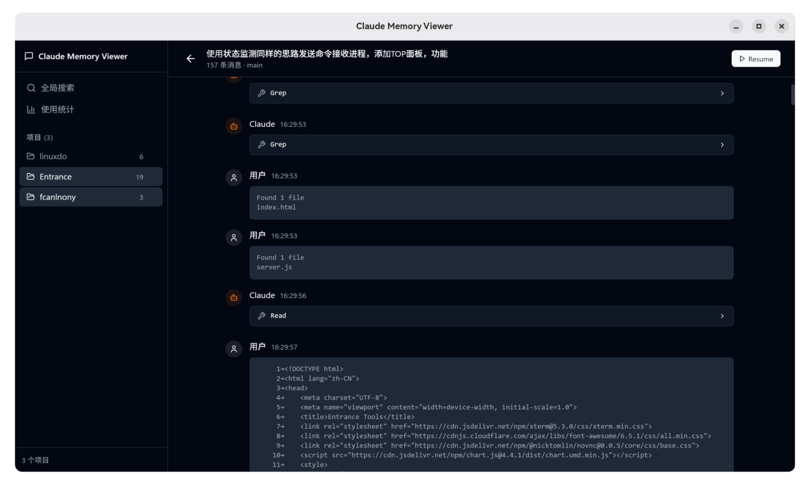
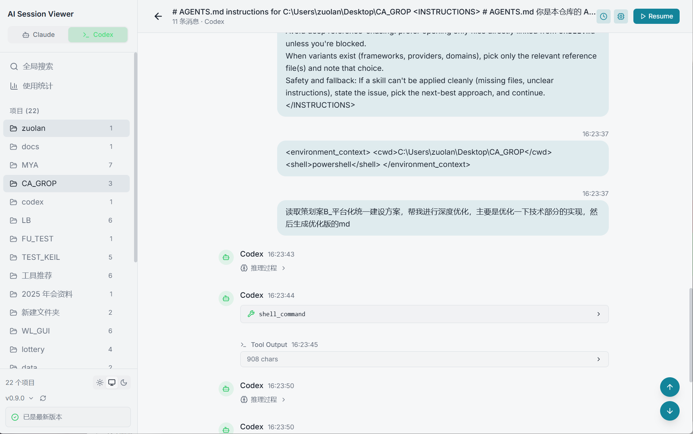
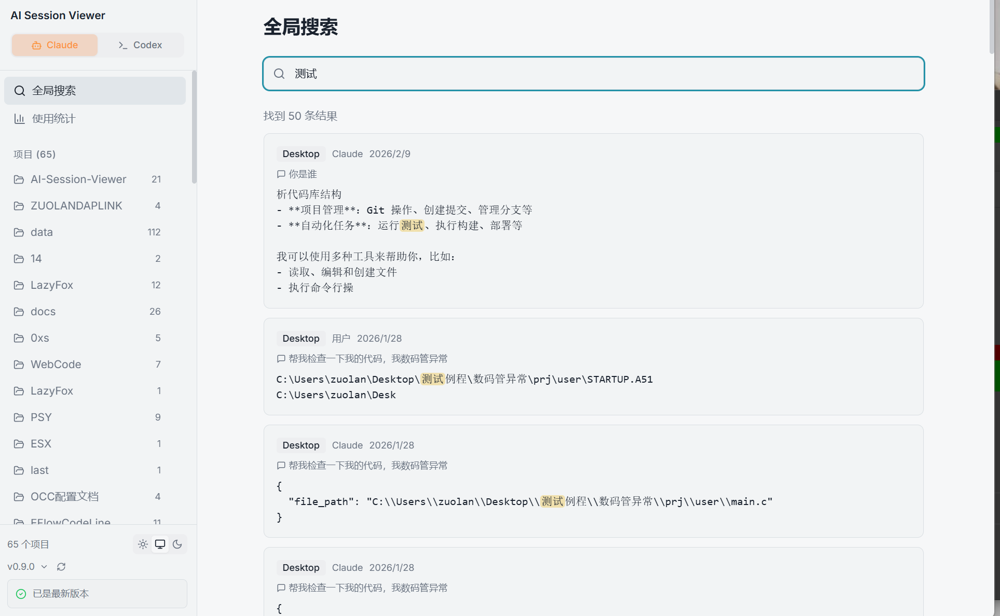
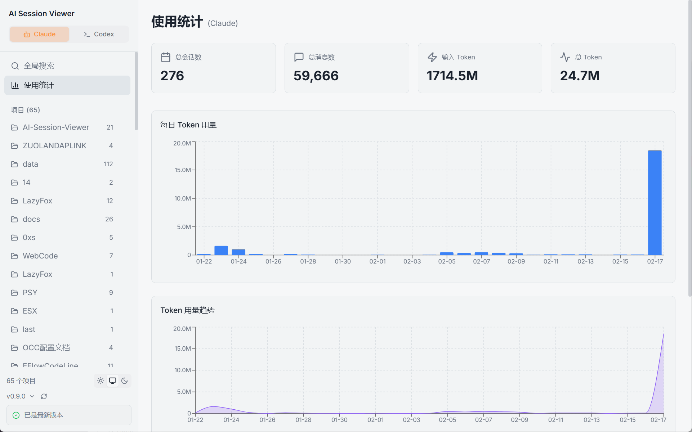

# AI Session Viewer

<p align="center">
  
</p>

<p align="center">
  <strong>Claude Code & Codex CLI 本地会话记忆的统一可视化浏览器</strong>
</p>

<p align="center">
  <a href="https://github.com/zuoliangyu/AI-Session-Viewer/releases">
    
  </a>
  <a href="https://github.com/zuoliangyu/AI-Session-Viewer/actions">
    
  </a>
  <a href="https://github.com/zuoliangyu/AI-Session-Viewer/blob/main/LICENSE">
    
  </a>
</p>

---

**AI Session Viewer** 是一个轻量级应用，让你可以在一个统一界面中浏览、搜索、统计来自 [Claude Code](https://docs.anthropic.com/en/docs/claude-code) 和 [OpenAI Codex CLI](https://github.com/openai/codex) 的所有本地会话记忆，并支持一键恢复（Resume）到对应 CLI 中继续对话。

本应用**只读取本地文件**，不联网、不上传任何数据。

## 截图

<table>
  <tr>
    <td></td>
    <td></td>
  </tr>
  <tr>
    <td></td>
    <td></td>
  </tr>
  <tr>
    <td></td>
    <td></td>
  </tr>
</table>

## 快速开始

### 桌面应用（推荐）

前往 [Releases](https://github.com/zuoliangyu/AI-Session-Viewer/releases) 下载对应平台的安装包：

| 平台 | 安装包 |
|------|--------|
| Windows | `.msi`（安装版）或 `.zip`（便携版） |
| macOS | `.dmg` |
| Linux | `.deb` / `.AppImage` |

安装后打开即可使用，应用会自动扫描本地的 Claude / Codex 会话数据。

> 前提：至少使用过 [Claude Code](https://docs.anthropic.com/en/docs/claude-code) 或 [Codex CLI](https://github.com/openai/codex)，对应的 `~/.claude/projects/` 或 `~/.codex/sessions/` 目录存在。

### Web 服务器

适合无 GUI 的服务器环境，通过浏览器远程访问。

**直接运行：**

```bash
# 最简启动（监听 127.0.0.1:3000）
./session-web

# 完整参数
./session-web --host 0.0.0.0 --port 8080 --token my-secret

# 环境变量
ASV_HOST=0.0.0.0 ASV_PORT=8080 ASV_TOKEN=my-secret ./session-web
```

| 参数 | 环境变量 | 默认值 | 说明 |
|------|---------|--------|------|
| `--host` | `ASV_HOST` | `127.0.0.1` | 监听地址 |
| `--port` | `ASV_PORT` | `3000` | 监听端口 |
| `--token` | `ASV_TOKEN` | *(无)* | Bearer Token 认证，不设则免认证 |

**Docker 运行：**

```bash
docker compose up
```

挂载路径、端口、Token 等参数在 [`docker-compose.yml`](docker-compose.yml) 中配置。

**公网访问：**

Web 服务器支持公网访问。将 `--host` 设为 `0.0.0.0` 即可监听所有网卡：

```bash
# 直接运行
./session-web --host 0.0.0.0 --port 8080 --token my-secret

# Docker（取消 docker-compose.yml 中 ASV_TOKEN 的注释，映射端口到公网）
docker compose up -d
```

Docker 默认已监听 `0.0.0.0`（通过 `ports: "3000:3000"`），只需在 `docker-compose.yml` 中取消 `ASV_TOKEN` 的注释并设置密钥即可安全地公网使用：

```yaml
environment:
  ASV_TOKEN: my-secret
```

> **安全提示：** 应用会读取服务器上的 `~/.claude/projects/` 和 `~/.codex/sessions/`，包含完整会话记录。公网暴露时**务必设置 Token** 启用 Bearer Token 认证。此外，应用本身不提供 HTTPS，生产环境建议前置 Nginx / Caddy 做反向代理并启用 TLS。

### Web 版与桌面版的差异

| 功能 | 桌面应用 | Web 服务器 |
|------|---------|-----------|
| 恢复会话 | 打开系统终端 | 复制命令到剪贴板 |
| CLI 对话 | 本地 spawn CLI 进程 | WebSocket 转发 |
| 快速问答 | Tauri 事件流 | SSE 流式响应 |
| 自动更新 | 应用内更新 | 不适用 |
| 文件监听 | Tauri 事件 | WebSocket 推送 |
| 认证 | 不需要 | 可选 Bearer Token |

## 功能特性

### 双数据源

通过侧边栏顶部的 Tab 一键切换 Claude / Codex 数据源：

| 数据源 | CLI 工具 | 本地存储路径 | 特色 |
|--------|---------|-------------|------|
| **Claude** (橙色主题) | [Claude Code](https://docs.anthropic.com/en/docs/claude-code) | `~/.claude/projects/` | Thinking 块、Tool Use、sessions-index 索引 |
| **Codex** (绿色主题) | [Codex CLI](https://github.com/openai/codex) | `~/.codex/sessions/` | Reasoning 块、Function Call、按日期归档 |

切换时自动清理状态并重新加载，互不干扰。

### 项目浏览

- 自动扫描对应数据源目录，列出所有项目
- Claude：按 `~/.claude/projects/{encoded-path}` 聚合
- Codex：按会话元数据中的 `cwd` 工作目录聚合
- 显示每个项目的会话数量、最后活跃时间
- 按最近活跃时间排序

### 会话列表

- Claude：读取 `sessions-index.json` 索引文件并与磁盘 `.jsonl` 文件合并，确保 Ctrl+C 退出的会话不会丢失
- Codex：扫描 `~/.codex/sessions/` 目录下所有 `rollout-*.jsonl` 文件，提取元数据
- 展示每个会话的首条 Prompt、消息数量、Git 分支、创建/修改时间
- 支持删除会话（带确认弹窗）

### 标签与别名

- 为任意会话设置**自定义别名**（替代首条 Prompt 作为标题）和**多个标签**
- 标签数据存储在 `.session-viewer-meta.json`，不侵入原始会话文件
- **项目列表页**：按标签筛选项目——只显示拥有匹配标签的项目
- **会话列表页**：按标签筛选当前项目内的会话
- **搜索结果页**：按标签筛选全局搜索结果
- 标签输入支持已有标签自动补全

### 消息详情

完整渲染会话中的所有消息，支持两种 AI 的不同内容块格式：

| 内容块类型 | Claude | Codex | 说明 |
|-----------|--------|-------|------|
| 文本 | ✅ | ✅ | Markdown 渲染 + 语法高亮 |
| 思考过程 | ✅ | — | Claude Thinking 块，可折叠 |
| 推理过程 | — | ✅ | Codex Reasoning 块，可折叠 |
| 工具调用 | ✅ | — | 工具名称、参数、返回结果 |
| 工具结果 | ✅ | — | 工具返回结果 |
| 函数调用 | — | ✅ | Codex 函数调用 |
| 函数返回 | — | ✅ | 函数调用返回结果 |

- 分页加载，大会话（上千条消息）也不会卡顿
- 默认从最新消息加载，进入会话直接看到最近对话
- 向上滚动自动加载更早的消息，滚动位置自动保持
- 浮动"跳转到顶部/底部"双向按钮
- 时间戳 / 模型标签可切换显示，偏好持久化

### 恢复会话

选中任意会话，一键在系统终端中恢复：

- **Claude** → 执行 `claude --resume {sessionId}`
- **Codex** → 执行 `codex resume {sessionId}`

终端完全独立于本应用——关闭 Viewer 后终端继续运行。跨平台支持：

| 平台 | 实现方式 |
|------|---------|
| Windows | `cmd /c start /d` 启动独立终端进程 |
| macOS | AppleScript 调用 Terminal.app |
| Linux | 自动检测 gnome-terminal / konsole / xfce4-terminal / xterm，`setsid` 脱离父进程 |

### 全局搜索

- 在当前数据源下跨所有项目、所有会话全文搜索
- 支持两种视图模式：**消息模式**（逐条匹配平铺）和**会话模式**（按会话分组，显示匹配数和摘要预览）
- 基于 Rayon 并行扫描 JSONL 文件
- UTF-8 安全的字符级切片，中文/emoji 不会崩溃
- 关键词高亮，点击结果直接跳转到对应消息

### Token 统计

- Claude：读取 `stats-cache.json` 统计缓存
- Codex：从每个会话文件提取 `usage` 字段聚合
- 展示：会话总数、消息总数、Input/Output Token 用量
- 每日 Token 用量柱状图
- Token 趋势面积图
- 按模型分组的 Token 消耗

### 应用内更新

| 安装方式 | 更新行为 |
|---------|---------|
| **安装版** (MSI/NSIS/DMG/DEB) | 应用内一键下载 + 自动安装 + 重启 |
| **便携版** (Windows Portable ZIP) | 检测到新版后引导跳转 GitHub Release 下载 |

- 启动后自动检查，Sidebar 底部显示版本号 + 手动检查按钮
- 有更新时版本号旁显示蓝色脉冲圆点，点击展开内嵌更新面板
- 支持忽略特定版本，不再重复提示
- 基于 `tauri-plugin-updater` + Ed25519 签名验证

### CLI 对话

在应用内直接与 Claude Code / Codex CLI 进行对话，无需切换到终端：

- 侧边栏点击「CLI 对话」进入，选择工作目录后即可开始
- 自动检测本地已安装的 CLI 工具
- 流式输出，实时渲染 AI 回复（Markdown + 代码高亮）
- 支持 `--resume` 继续已有会话（消息详情页的「继续对话」按钮）
- 输入框支持 `/model` 命令切换模型

> **模型切换提示**：建议使用 `/model claude-opus-4-6` 的方式手动指定模型 ID，内置模型选择器存在已知 bug。模型 ID 示例：`claude-sonnet-4-6`、`claude-opus-4-6`、`claude-haiku-4-5`。

### 快速问答

不依赖 CLI，直接调用 API 进行纯文本对话：

- 侧边栏点击「快速问答」进入
- 自动读取本地 CLI 配置文件中的 API Key（无需手动输入）
- 支持 Claude（Anthropic API）和 Codex（OpenAI API）
- SSE 流式输出，Markdown 实时渲染
- 无需选择工作目录，适合快速提问

### 实时刷新

- 使用 `notify` crate 同时监听两个目录的文件系统变化
- 新会话创建、会话更新时自动刷新界面
- Docker 挂载卷优化：静默后台刷新 + 1 秒防抖，避免频繁 inotify 事件导致界面闪烁

## 开发

### 前置要求

- [Node.js](https://nodejs.org/) >= 18
- [Rust](https://www.rust-lang.org/tools/install) >= 1.75
- 至少使用过以下一种 CLI：
  - [Claude Code](https://docs.anthropic.com/en/docs/claude-code)（`~/.claude/projects/` 目录存在）
  - [Codex CLI](https://github.com/openai/codex)（`~/.codex/sessions/` 目录存在）

**平台依赖（仅桌面应用需要）：**

- **Windows:** [Visual C++ Build Tools](https://visualstudio.microsoft.com/visual-cpp-build-tools/) + [WebView2](https://developer.microsoft.com/en-us/microsoft-edge/webview2/)（Win10/11 通常已内置）
- **macOS:** `xcode-select --install`
- **Linux (Ubuntu/Debian):** `sudo apt install libwebkit2gtk-4.1-dev libappindicator3-dev librsvg2-dev patchelf`

> Web 服务器版本不需要上述 WebKit/GUI 依赖，只需 Rust 工具链。

### 本地开发

```bash
git clone https://github.com/zuoliangyu/AI-Session-Viewer.git
cd AI-Session-Viewer
npm install

# 桌面应用开发（Tauri + Vite HMR）
npx tauri dev

# Web 服务器开发
npm run dev:web
```

> **注意**: 桌面应用不能只运行 `npm run dev`，那只会启动 Vite 前端。必须用 `npx tauri dev` 才能同时编译 Rust 后端并启动完整应用。

### 构建

**桌面应用：**

```bash
npx tauri build
```

产物位于 `target/release/bundle/`（`.msi` / `.exe` / `.dmg` / `.deb` / `.AppImage`）。

**Web 服务器：**

```bash
npm run build:web && cargo build -p session-web --release
```

产出单文件可执行：`target/release/session-web`

**Docker：**

```bash
docker build -t ai-session-viewer-web .
```

### 代码检查

```bash
cargo clippy --workspace -- -D warnings   # Rust lint
npx tsc --noEmit                           # TypeScript 类型检查
```

## 技术栈

| 层级 | 技术 |
|------|------|
| 桌面框架 | [Tauri v2](https://v2.tauri.app/) (Rust + WebView) |
| Web 服务器 | [Axum](https://github.com/tokio-rs/axum) 0.8 + WebSocket |
| 前端 | React 19 + TypeScript + Vite 6 |
| 样式 | Tailwind CSS 3 + @tailwindcss/typography |
| 状态管理 | Zustand 5 |
| Markdown | react-markdown 9 + remark-gfm + react-syntax-highlighter |
| 图表 | Recharts 2 |
| 共享核心 | session-core（Rust crate，models/provider/search/stats） |
| 并行搜索 | Rayon 1.10 (Rust) |
| 自动更新 | tauri-plugin-updater 2 (Rust) |

## 架构

```
              React 前端（100% 复用）
   ┌──────────────────────────────────────┐
   │  Zustand Store + Components          │
   │  ┌──────────┐    ┌────────────────┐  │
   │  │tauriApi.ts│    │  webApi.ts     │  │
   │  │(invoke)   │    │  (fetch/ws)    │  │
   │  └─────┬─────┘    └───────┬────────┘  │
   └────────┼───────────────────┼──────────┘
            │                   │
    Tauri IPC              REST + WebSocket
            │                   │
   ┌────────┴────────┐  ┌──────┴─────────┐
   │   src-tauri/    │  │  session-web/  │
   │  (Tauri 桌面)   │  │  (Axum HTTP)   │
   └────────┬────────┘  └──────┬─────────┘
            │                  │
            └────────┬─────────┘
                     │
           ┌─────────┴─────────┐
           │   session-core    │  ← 共享 Rust 核心
           │ models / provider │
           │ search / stats    │
           └─────────┬─────────┘
                     │
          ┌──────────┼──────────┐
          │          │          │
     ~/.claude/  ~/.codex/   文件系统
```

前端通过编译时变量 `__IS_TAURI__` 自动切换 API 层（Tauri invoke vs HTTP fetch），组件代码 100% 复用。

### REST API

Web 服务器暴露以下 REST API，可供自定义客户端调用：

| 方法 | 路径 | Query 参数 | 说明 |
|------|------|-----------|------|
| GET | `/api/projects` | `source` | 获取项目列表 |
| GET | `/api/sessions` | `source, projectId` | 获取会话列表 |
| DELETE | `/api/sessions` | `filePath` | 删除会话 |
| GET | `/api/messages` | `source, filePath, page, pageSize, fromEnd` | 分页加载消息 |
| GET | `/api/search` | `source, query, maxResults` | 全局搜索 |
| GET | `/api/stats` | `source` | Token 统计 |
| PUT | `/api/sessions/meta` | *(JSON body)* | 更新会话别名和标签 |
| GET | `/api/tags` | `source, projectId` | 获取项目内所有标签 |
| GET | `/api/cross-tags` | `source` | 获取跨项目全局标签 |
| GET | `/api/cli/detect` | — | 检测本地已安装的 CLI 工具 |
| GET | `/api/cli/config` | `source` | 读取 CLI 配置（API Key 遮罩） |
| POST | `/api/models` | *(JSON body)* | 获取模型列表 |
| POST | `/api/quick-chat` | *(JSON body)* | 快速问答（SSE 流式响应） |
| WS | `/ws` | — | 文件变更实时推送 |
| WS | `/ws/chat` | — | CLI 对话 WebSocket |

## 发布

标签触发：`git tag v1.x.0 && git push origin v1.x.0`。GitHub Actions 会自动：

1. 在 Windows、macOS（Intel + Apple Silicon）、Linux 上并行构建桌面应用
2. 构建 Web 服务器 Linux 二进制 + Docker 镜像（推送到 GHCR）
3. 生成各平台安装包 + `.sig` 签名文件 + `latest.json` 更新清单
4. 创建 GitHub Release 并上传所有产物

版本工作流：修改 `package.json` 中的 version → 执行 `npm run sync-version` → 提交并打标签。

## 路线图

- [x] 双数据源支持（Claude Code + Codex CLI）
- [x] 消息详情渲染（Markdown / 代码高亮 / 工具调用 / 思考过程）
- [x] Resume 会话（跨平台终端启动）
- [x] 全局搜索 + Token 统计面板
- [x] 暗色 / 亮色主题切换
- [x] 应用内自动更新
- [x] Web 服务器变体（Axum + Docker）
- [x] 关于作者信息弹窗
- [x] 会话标签与别名系统 + 跨项目标签筛选
- [x] 全局搜索会话分组模式 + 应用内使用说明
- [x] 应用内 CLI 对话 + 快速问答模式
- [x] CLI 配置自动检测（API Key / Base URL / 默认模型）
- [ ] 自定义标题栏
- [ ] 更多 AI CLI 数据源支持（Gemini CLI 等）

## 贡献

欢迎提交 Issue 和 Pull Request。

## 许可证

[MIT](LICENSE)
