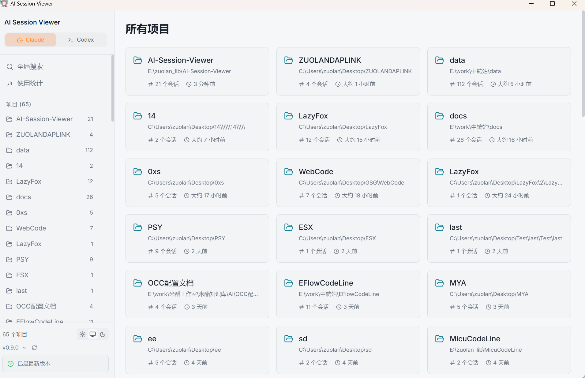
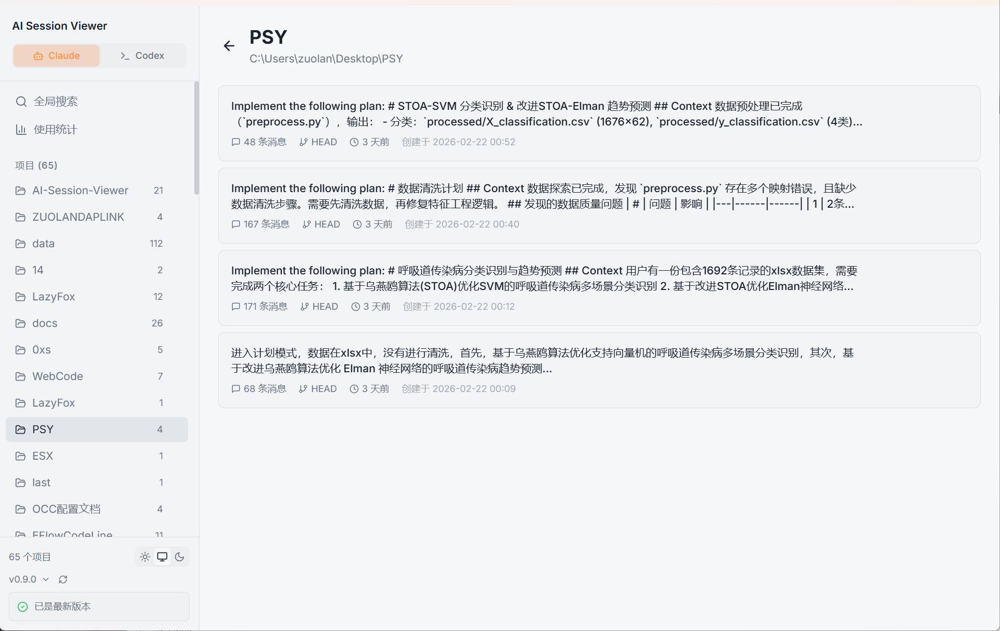
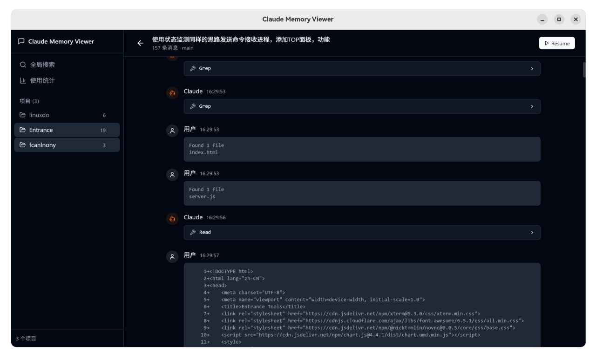
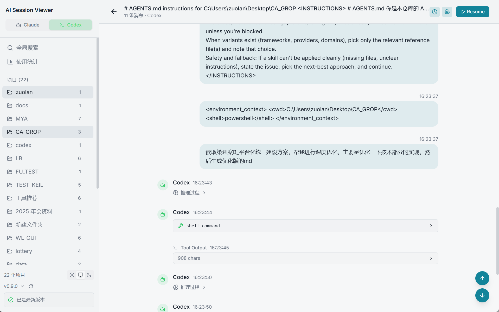
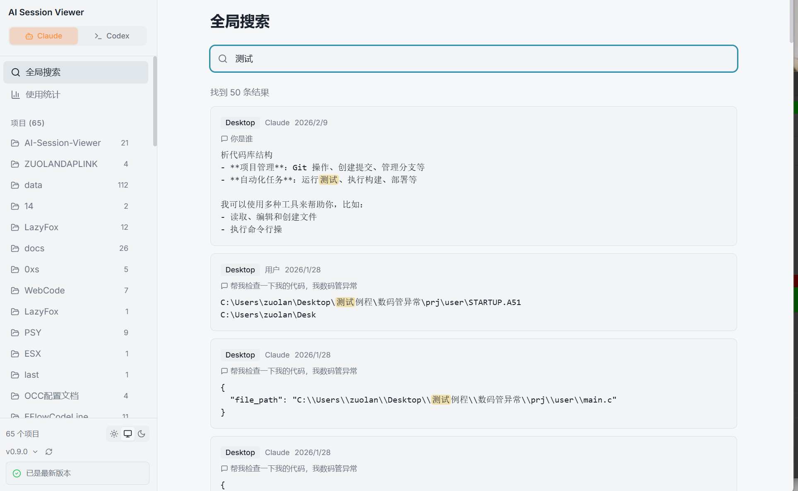
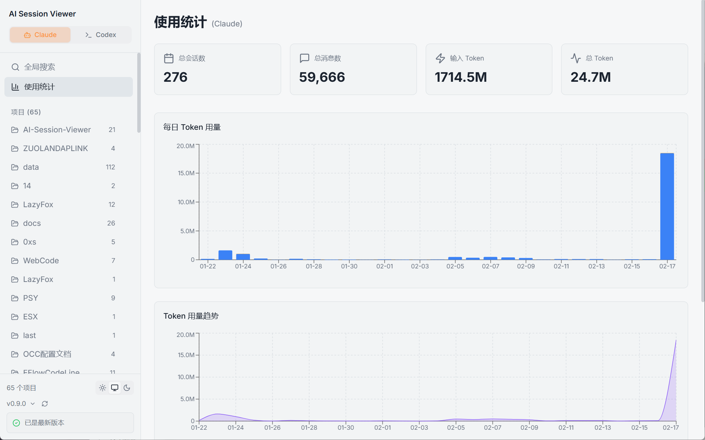

# AI Session Viewer

<p align="center">
  
</p>

<p align="center">
  <strong>Claude Code、Codex CLI 与 Grok CLI 本地会话的统一可视化浏览器</strong>
</p>

<p align="center">
  <a href="https://github.com/zuoliangyu/AI-Session-Viewer/releases">
    
  </a>
  <a href="https://github.com/zuoliangyu/AI-Session-Viewer/actions">
    
  </a>
  <a href="https://github.com/zuoliangyu/AI-Session-Viewer/blob/main/LICENSE">
    
  </a>
</p>

---

**AI Session Viewer** 是一个轻量级应用，让你可以在一个统一界面中浏览、搜索来自 [Claude Code](https://docs.anthropic.com/en/docs/claude-code)、[OpenAI Codex CLI](https://github.com/openai/codex) 和 Grok CLI 的本地会话，并支持一键恢复（Resume）到对应 CLI 中继续对话。

本应用**仅处理本地会话文件**，不上传任何数据；删除、标签、别名等写操作只在用户主动触发时执行。

> **What's New（v2.16.3）**：修复应用关闭期间新增、修改或删除的 Codex rollout 未同步到项目列表的问题；缓存现在会在启动时自动对账，并在「所有项目」页提供“刷新缓存”按钮，可随时手动完整重建项目索引。完整版本历史见 [CHANGELOG.md](./CHANGELOG.md)。
>
> v2.15.x 起：在 **Codex desktop 中归档 / 删除的会话**残留为「(无标题)」幽灵条目已修复（删除对「文件已消失」幂等）；**会话导出**（JSON / Markdown / HTML，单个 + 批量）、**批量删除会话 / 项目**（移入回收站可还原）、**Codex 项目删除**；初次启动**扫描进度条** + 冷启动 rayon 限流给 UI 留一核，会话页 / 项目页全面**列表虚拟化**（`@tanstack/react-virtual`）。

## 截图

<table>
  <tr>
    <td></td>
    <td></td>
  </tr>
  <tr>
    <td></td>
    <td></td>
  </tr>
  <tr>
    <td></td>
    <td></td>
  </tr>
</table>

## 快速开始

### 桌面应用（推荐）

前往 [Releases](https://github.com/zuoliangyu/AI-Session-Viewer/releases) 下载对应平台的安装包：

| 平台 | 安装包 |
|------|--------|
| Windows | `.msi`（安装版）或 `.zip`（便携版） |
| macOS (Universal) | `.dmg`（同时支持 Intel 和 Apple Silicon） |
| Linux | `.deb` / `.AppImage` |

安装后打开即可使用，应用会自动扫描本地的 Claude / Codex / Grok 会话数据。

> 前提：至少使用过一种受支持 CLI，对应的 `~/.claude/projects/`、`~/.codex/sessions/` 或 `$GROK_HOME/sessions/`（默认 `~/.grok/sessions/`）目录存在。

### Web 服务器

适合无 GUI 的服务器环境，通过浏览器远程访问。二进制为 musl 静态编译，**零系统依赖**，任何 Linux 发行版（Ubuntu、Debian、Rocky、CentOS、Alpine 等）下载即可运行。

**直接运行（推荐）：**

```bash
# 最简启动（默认监听 0.0.0.0:3000，所有网卡可访问）
./session-web

# 限制只监听本机（仅 localhost 可访问）
./session-web --host 127.0.0.1

# 完整参数（公网暴露时务必设置 --token）
./session-web --host 0.0.0.0 --port 8080 --token my-secret

# 环境变量
ASV_HOST=0.0.0.0 ASV_PORT=8080 ASV_TOKEN=my-secret ./session-web
```

| 参数 | 环境变量 | 默认值 | 说明 |
|------|---------|--------|------|
| `--host` | `ASV_HOST` | `0.0.0.0` | 监听地址（`0.0.0.0` = 所有网卡，`127.0.0.1` = 仅本机） |
| `--port` | `ASV_PORT` | `3000` | 监听端口 |
| `--token` | `ASV_TOKEN` | *(无)* | Bearer Token 认证，不设则**免认证**（局域网/公网部署必须设置） |

**直接运行 vs Docker：**

|  | 直接运行二进制（推荐） | Docker |
|---|---|---|
| CLI 对话 / Resume | ✅ 完整支持（直接调用宿主机 CLI） | ❌ 容器隔离，无法访问宿主机 CLI |
| 系统依赖 | 无（musl 静态编译） | 需要 Docker |
| 部署方式 | 下载 → `chmod +x` → 运行 | `docker compose up` |
| 适用场景 | **个人服务器、需要对话功能** | **团队共享、只浏览历史记录** |

**Docker 运行：**

```bash
docker compose up        # 前台
docker compose up -d     # 后台
```

挂载路径、端口、Token 等在 [`docker-compose.yml`](docker-compose.yml) 配置；公网部署时取消 `ASV_TOKEN` 注释并设置密钥：

```yaml
environment:
  ASV_TOKEN: my-secret
```

> ⚠️ **安全警告**
>
> 应用会读取服务器上的 `~/.claude/projects/`、`~/.codex/sessions/` 和 `~/.grok/sessions/`，包含**完整会话记录（可能含 API Key、代码、隐私对话）**。务必按部署场景采取措施：
>
> | 场景 | 建议措施 |
> |------|---------|
> | **仅本机使用** | `--host 127.0.0.1`，仅 localhost 可达 |
> | **局域网共享** | 设置 `ASV_TOKEN`，防火墙限制端口仅内网可达 |
> | **公网暴露** | 设置 `ASV_TOKEN` + 前置 Nginx/Caddy 反向代理 + 启用 HTTPS/TLS |
>
> 应用本身**不提供 HTTPS**，明文 HTTP 下 Token 亦明文传输，生产环境务必在反向代理层终止 TLS。

### Web 版与桌面版的差异

| 功能 | 桌面应用 | Web 服务器 |
|------|---------|-----------|
| 恢复会话 | 打开系统终端 | 复制命令到剪贴板 |
| 会话分叉 | 创建新会话 + 终端打开 | 不适用 |
| CLI 对话 | 本地 spawn CLI 进程 | WebSocket 转发 |
| 自动更新 | 应用内更新 | 不适用 |
| 文件监听 | Tauri 事件 | WebSocket 推送 |
| 认证 | 不需要 | 可选 Bearer Token |

## 功能特性

### 三数据源

侧边栏顶部 Tab 一键切换 Claude / Codex / Grok，切换时自动清理状态并重新加载，互不干扰。

| 数据源 | CLI 工具 | 本地数据 | 特色内容块 |
|--------|---------|---------|-----------|
| **Claude**（橙色主题） | [Claude Code](https://docs.anthropic.com/en/docs/claude-code) | `~/.claude/projects/` | Thinking、工具调用 |
| **Codex**（绿色主题） | [Codex CLI](https://github.com/openai/codex) | `~/.codex/sessions/` | Reasoning、函数调用 |
| **Grok**（紫色主题） | Grok CLI | `$GROK_HOME/sessions/` 或 `~/.grok/sessions/` | Reasoning、文本消息 |

### 项目浏览

启动即扫描数据源目录，秒开列出所有项目，按最近活跃时间排序，显示每个项目的会话数和最后活跃时间。

- **工程操作菜单**（卡片 / 侧边栏行悬停出现的 `⋯`）：复制工程路径、删除会话数据支持所有数据源（Codex 含按日期合成的虚拟项目）；设置工程别名和删除源代码仍为 Claude 专属
- **批量删除项目**：列表右上角「选择」进入多选模式，勾选多个工程后底部操作条一键删除（移入回收站可还原），Claude 可选「同时清理 CC 配置」
- **工程别名**：设置自定义显示名，不改磁盘目录，删除工程时随目录自动清理
- **删除源代码保护**：可选连同本地源代码目录一起删，删前自动检查 Git 状态（未提交 / 未推送）并要求输入项目名确认
- **列表虚拟化**：项目列表按窗口宽度自适应 1~3 列后做行级虚拟化，几百个工程也只渲染可见行，滚动 / 切换多选恒定流畅；首次启动显示扫描进度条
- **手动刷新缓存**：项目列表右上角可主动重建项目缓存；Codex 会完整重扫 rollout 索引，适合文件监听遗漏或外部批量变更后的立即同步
- **Codex 未归属会话**：codex 数据源中 `cwd` 字段为空的会话（CLI 在无 git/无目录上下文里启动等情况）会按 rollout 文件日期合成虚拟项目，名为「未归属 · YYYY-MM-DD」，侧栏用 `FolderClock` 图标区分，不再被静默丢弃

### 会话列表

点进工程时精确扫描该工程的会话，展示每个会话的首条 Prompt、消息数、Git 分支、创建 / 修改时间。

- Claude：Ctrl+C 退出的会话也不会丢失
- Codex：自动过滤非交互式会话（SubAgent、Exec 等内部会话）
- Grok：读取 `summary.json` 与 `chat_history.jsonl`，自动忽略系统提示和合成提醒
- 支持删除会话（带确认弹窗）
- **会话导出**：单个会话悬停「导出」按钮，选 JSON / Markdown / HTML 任一格式保存；桌面端走系统保存框，Web 端浏览器下载
- **批量选择**：右上角「选择」进入多选模式，可一次**批量导出**（每会话一个文件）或**批量删除**（移入回收站可还原）多个会话
- **清理空会话**：存在无消息的空会话时标题栏出现「清理空会话 (N)」，可逐条勾选或全选批量删除
- **列表虚拟化**：会话列表只渲染可见行，几百上千会话切换多选、滚动都不卡；首次进入显示扫描进度条

### 标签与别名

为任意会话设置自定义别名（替代首条 Prompt 作为标题）和多个标签。

- **与 Claude Code `/rename` 双向同步**：CC 里 `/rename xxx` 后 app 自动显示新名；app 内改别名 CC 也能识别
- 项目列表 / 会话列表 / 搜索结果三处均可按标签筛选
- 标签输入支持已有标签自动补全

### 消息详情

完整渲染会话所有消息，支持三种 AI 的内容块格式：

| 内容块 | Claude | Codex | Grok | 渲染 |
|-------|--------|-------|------|------|
| 文本 | ✅ | ✅ | ✅ | Markdown + 语法高亮 |
| 思考 / 推理过程 | ✅ Thinking | ✅ Reasoning | ✅ Reasoning | 可折叠 |
| 工具 / 函数调用 | ✅ | ✅ | — | 名称、参数、返回结果 |

- 大会话（上千条消息）分页加载不卡顿，默认从最新消息开始
- 向上滚动自动加载更早消息并保持滚动位置；首屏不足一屏时自动补页
- 顶部「已加载 N / M 条」进度条，浮动「跳到顶部 / 底部」按钮
- **跳到百分比**：顶部 `0% / 25% / 50% / 75% / 100%` 预设按钮 + 数字输入框，右侧可拖动竖直滑条——长会话里一键定位到任意进度，只加载目标位置附近的一小段窗口，无需"加载全部"
- 时间戳 / 模型标签可切换显示（偏好持久化），工具输出自动清除 ANSI 控制字符

### 恢复会话

选中会话一键在系统终端恢复（Claude → `claude --resume {id}`，Codex → `codex resume {id}`，Grok → `grok -r {id}`）。终端独立于本应用，关闭 Viewer 后继续运行。Windows / macOS / Linux 均支持，自动适配各平台终端。

### 会话分叉（Fork）

在消息详情页中，hover 任意用户消息时右侧会出现操作按钮组：

| 按钮 | 图标 | 功能 |
|------|------|------|
| Resume | ▶ Play | 在终端中恢复当前会话 |
| Fork | 🔀 GitFork | 从此消息处分叉出新会话 |
| Star | ⭐ Star | 收藏此消息 |

**Fork**：从选中消息及之前的内容创建一个新会话并在终端打开，适合从历史对话某个节点开新分支探索。

> 仅 Tauri 桌面模式 + Claude 数据源可用。

### 全局搜索

跨所有项目、所有会话全文搜索，搜索词同时命中会话别名和首条 Prompt（结果标注「会话名」区分）。

- **两种视图**：消息模式（逐条匹配平铺）/ 会话模式（按会话分组，显示「X 条匹配 / 共 N 条」）
- 点击结果直接跳到第一条匹配处并高亮，无需手动翻找
- 关键词高亮、按标签筛选、悬停一键复制会话名

### Token 统计与花费分析

> 当前仅支持 Claude 与 Codex；Grok 本地历史不包含统一的 Token/花费字段，因此切换到 Grok 时隐藏此入口。

汇总会话总数、消息总数、Input / Output / Cache 读写 Token 用量、**累计 USD 花费**与**缓存命中率**，提供每日（或按小时）用量柱状图、花费趋势、缓存命中率走势、项目花费排行、按模型分组消耗。

- **逐请求账单（`/stats/requests`）**：虚拟滚动表格列出每条 assistant 请求的 token / 耗时 / cost，支持项目 / 模型 / 起止日期筛选，URL 参数可分享；点击行直接跳到对应消息
- **会话级账单徽标**：消息详情页顶栏 chip 显示本会话累计 cost + 请求次数，点击弹 Modal 看每条迷你账单，「复制 Markdown」一键导出表格
- **项目花费排行 Top10**：水平柱状图按 cost 降序，点击柱形跳到该项目的逐请求账单
- **缓存命中率走势**：按模型分线 + 60% 经验参考线，Legend 改为可点选 chip 切换显示 / 隐藏曲线
- **「今天」自动按小时聚合**：单日筛选时图表自动切换为 24 小时桶视图，避免单点死图
- **内置模型价格表**：Claude 3.x/4.x、GPT-5/4.x/4o、o1/o3/o4 主流模型；Anthropic cache_creation 1.25× / cache_read 0.10× 倍率自动应用
- **性能**：进程内常驻 cache + Singleflight 节流 + 异步落盘 + Compact schema，57MB 大 cache 用户进入 Stats 页从 4-8 秒降到 ~50ms

### 应用内更新

| 安装方式 | 更新行为 |
|---------|---------|
| **安装版** (MSI/NSIS/DMG/DEB) | 应用内一键下载 + 自动安装 + 重启 |
| **便携版** (Windows Portable ZIP) | 检测到新版后引导跳转 GitHub Release 下载 |

- 启动约 1.5 秒后自动检查，发现新版直接弹确认框；设置弹窗「更新检查」可看完整面板
- 可查看版本变化 / Release Notes，支持忽略特定版本不再提示

### CLI 对话

侧边栏「CLI 对话」进入，选工作目录后即可在应用内直接和 Claude Code CLI 对话，无需切到终端（自动检测本地已装的 Claude CLI）。

- 流式输出，实时渲染 AI 回复（Markdown + 代码高亮）
- **工具调用专用查看器**：Read（高亮 + 行号）、Edit（Diff）、Write（预览）、Bash（终端风格）、Grep/Glob
- 对话按轮次分组（显示轮次编号与 token 用量），header 累计 token、每条消息分项明细
- 超过 30 轮自动虚拟滚动，长对话不卡
- 支持 `--resume` 续聊已有会话（消息详情页「继续对话」入口）
- 自动记住上次模型、续聊历史会话时自动匹配原会话模型；`/model` 或 `Ctrl+K` 切换模型

### Skills 浏览 / 导入 / 删除

侧边栏「Skills」进入独立页面，会话页顶部也内嵌一个可折叠 Skills 面板，统一查看 Claude Code 的三类 skills：

| 来源 | 路径 | 可写 |
|------|------|------|
| **全局** | `~/.claude/skills/`（**跟随符号链接**，正确收录 `lark-*` 等软链） | ✅ |
| **插件** | `~/.claude/plugins/{marketplaces,cache}/**/SKILL.md`（按 name 去重） | 只读 |
| **项目级** | `<当前项目>/.claude/skills/`（取应用内正在浏览项目的真实路径） | ✅ |

- **查看全文**：点击任一 skill 弹窗渲染完整 `SKILL.md`（Markdown，自动剥离 frontmatter），可复制路径
- **导入压缩包**：选作用域（全局 / 当前项目）+ 选 `.zip` + 可勾「覆盖同名」；自动识别根级 `SKILL.md`（整包为一个 skill）或多个 `<子目录>/SKILL.md`（逐个导入），内置 zip-slip 防护
- **删除**（仅全局 / 项目，插件只读不动）：悬停删除 + 二次确认；**符号链接只移除链接、保留原始文件**，真实目录永久删除并提示不可恢复

### 无效项管理

侧边栏「无效项管理」按项目分组扫描异常数据（无效项目 = 路径不存在；无效会话 = 消息数为 0），批量勾选后统一清理。桌面端删除入回收站，Web 端为永久删除。

> Codex 数据源当前仅支持清理无效会话，不支持删除无效项目索引。

### Codex Provider 同步

仅 Codex 数据源可见。切换 Codex 供应商后，老 rollout 文件和 `state_5.sqlite` 还指向旧 provider，导致 Codex Desktop / `/resume` 看不到历史会话。本工具一键追平：

- **状态总览**：按 provider 列出 `~/.codex/sessions/`、`~/.codex/archived_sessions/`、SQLite `threads` 表的分布与不一致计数，并扫出含 `encrypted_content` 的危险会话
- **同步 / 切换**：改 rollout 首行 `payload.model_provider`、SQLite 三类 update（model_provider / has_user_event / cwd 单事务）、规范化 `.codex-global-state.json` 的 Windows verbatim 路径；切换还会改写 `config.toml` 顶层 `model_provider`
- **备份与恢复**：每次写之前完整拷贝 SQLite/config/global-state 到 `~/.codex/backups_state/provider-sync/<时间戳>/`，rollout 改动只记首行原文 + mtime；恢复时可勾选粒度（config / db / sessions / global-state 各自独立开关）

> 含加密内容的会话即使同步成功，"继续对话"或 compact 仍可能报 `invalid_encrypted_content` — 若需可靠续聊，请切回原 provider。

### 实时刷新

新会话创建、会话更新时自动刷新界面。桌面端每 10 分钟静默后台刷新一次项目与会话缓存；Docker 挂载卷下做了防抖，避免界面频繁闪烁。

### 数据安全

- **原子写入**：所有元数据 / 索引 / 书签文件均原子落盘，进程异常中断不会留下损坏或截断的文件
- **软删除回收站**：删除会话 / 清理空项目移入回收站，可随时恢复，不会立即永久删除

## 开发

### 前置要求

- [Node.js](https://nodejs.org/) >= 18
- [Rust](https://www.rust-lang.org/tools/install) >= 1.75
- 至少使用过以下一种 CLI：
  - [Claude Code](https://docs.anthropic.com/en/docs/claude-code)（`~/.claude/projects/` 目录存在）
  - [Codex CLI](https://github.com/openai/codex)（`~/.codex/sessions/` 目录存在）

**平台依赖（仅桌面应用需要）：**

- **Windows:** [Visual C++ Build Tools](https://visualstudio.microsoft.com/visual-cpp-build-tools/) + [WebView2](https://developer.microsoft.com/en-us/microsoft-edge/webview2/)（Win10/11 通常已内置）
- **macOS:** `xcode-select --install`
- **Linux (Ubuntu/Debian):** `sudo apt install libwebkit2gtk-4.1-dev libappindicator3-dev librsvg2-dev patchelf`

> Web 服务器版本不需要上述 WebKit/GUI 依赖，只需 Rust 工具链。

### 本地开发

```bash
git clone https://github.com/zuoliangyu/AI-Session-Viewer.git
cd AI-Session-Viewer
npm install

# 桌面应用开发（Tauri + Vite HMR）
npx tauri dev

# Web 服务器开发
npm run dev:web
```

> **注意**: 桌面应用不能只运行 `npm run dev`，那只会启动 Vite 前端。必须用 `npx tauri dev` 才能同时编译 Rust 后端并启动完整应用。

### 构建

**桌面应用：**

```bash
npx tauri build
```

产物位于 `target/release/bundle/`（`.msi` / `.exe` / `.dmg` / `.deb` / `.AppImage`）。

**Web 服务器：**

```bash
npm run build:web && cargo build -p session-web --release
```

产出单文件可执行：`target/release/session-web`

**Docker：**

```bash
docker build -t ai-session-viewer-web .
```

### 代码检查

```bash
cargo clippy --workspace -- -D warnings   # Rust lint
npx tsc --noEmit                           # TypeScript 类型检查
```

> Linux 上如果 `cargo check --workspace` / `cargo clippy --workspace` 报 `glib`、`gobject`、`gio`、`libsoup` 等原生库缺失，通常不是 Rust 代码错误，而是桌面端 Tauri 依赖未安装完整。请先按上面的 Linux 桌面依赖说明补齐环境后再检查；如果你当前只开发 Web 服务器，可先只验证 `session-web` 相关目标。

## 技术栈

| 层级 | 技术 |
|------|------|
| 桌面框架 | [Tauri v2](https://v2.tauri.app/) (Rust + WebView) |
| Web 服务器 | [Axum](https://github.com/tokio-rs/axum) 0.8 + WebSocket |
| 前端 | React 19 + TypeScript + Vite 6 |
| 样式 | Tailwind CSS 3 + @tailwindcss/typography |
| 状态管理 | Zustand 5 |
| Markdown | react-markdown 9 + remark-gfm + react-syntax-highlighter |
| 图表 | Recharts 2 |
| 共享核心 | session-core（Rust crate，models/provider/search/stats） |
| 并行搜索 | Rayon 1.10 (Rust) |
| 自动更新 | tauri-plugin-updater 2 (Rust) |

## 架构

```
              React 前端（100% 复用）
   ┌──────────────────────────────────────┐
   │  Zustand Store + Components          │
   │  ┌──────────┐    ┌────────────────┐  │
   │  │tauriApi.ts│    │  webApi.ts     │  │
   │  │(invoke)   │    │  (fetch/ws)    │  │
   │  └─────┬─────┘    └───────┬────────┘  │
   └────────┼───────────────────┼──────────┘
            │                   │
    Tauri IPC              REST + WebSocket
            │                   │
   ┌────────┴────────┐  ┌──────┴─────────┐
   │   src-tauri/    │  │  session-web/  │
   │  (Tauri 桌面)   │  │  (Axum HTTP)   │
   └────────┬────────┘  └──────┬─────────┘
            │                  │
            └────────┬─────────┘
                     │
           ┌─────────┴─────────┐
           │   session-core    │  ← 共享 Rust 核心
           │ models / provider │
           │ search / stats    │
           └─────────┬─────────┘
                     │
          ┌──────────┼──────────┐
          │          │          │
     ~/.claude/  ~/.codex/   文件系统
```

前端通过编译时变量 `__IS_TAURI__` 自动切换 API 层（Tauri invoke vs HTTP fetch），组件代码 100% 复用。

### REST API

Web 服务器暴露以下 REST API，可供自定义客户端调用：

| 方法 | 路径 | Query 参数 | 说明 |
|------|------|-----------|------|
| GET | `/api/projects` | `source` | 获取项目列表 |
| GET | `/api/sessions` | `source, projectId` | 获取会话列表 |
| DELETE | `/api/sessions` | `filePath` | 删除会话 |
| GET | `/api/messages` | `source, filePath, page, pageSize, fromEnd` | 分页加载消息 |
| GET | `/api/export` | `source, filePath, format` | 导出会话为 JSON / Markdown / HTML |
| GET | `/api/scan-progress` | — | 冷启动扫描进度 |
| GET | `/api/skills` | `projectPath?` | 列出全局 / 插件 / 项目级 skills |
| GET | `/api/skills/content` | `path` | 读取单个 `SKILL.md` 全文 |
| POST | `/api/skills/import` | `scope, projectPath?, overwrite?, archiveName?` + *(zip body)* | 导入 skill 压缩包 |
| DELETE | `/api/skills` | `scope, projectPath?, slug` | 删除全局 / 项目 skill |
| GET | `/api/search` | `source, query, maxResults` | 全局搜索 |
| GET | `/api/stats` | `source` | Token 统计汇总（含 cache / cost） |
| GET | `/api/stats/requests` | `source, projectId?, sessionId?, startDate?, endDate?, model?, page?, pageSize?` | 逐请求账单分页查询 |
| GET | `/api/stats/projects` | `source` | 项目花费排行（按 cost 降序） |
| GET | `/api/stats/session` | `source, filePath` | 单会话累计账单 + 每条请求明细 |
| PUT | `/api/sessions/meta` | *(JSON body)* | 更新会话别名和标签 |
| GET | `/api/tags` | `source, projectId` | 获取项目内所有标签 |
| GET | `/api/cross-tags` | `source` | 获取跨项目全局标签 |
| GET | `/api/bookmarks` | `source` (可选) | 获取收藏列表 |
| POST | `/api/bookmarks` | *(JSON body)* | 添加收藏 |
| DELETE | `/api/bookmarks/:id` | — | 删除收藏 |
| GET | `/api/cli/detect` | — | 检测本地已安装的 CLI 工具 |
| GET | `/api/cli/config` | `source` | 读取 CLI 配置（API Key 遮罩） |
| POST | `/api/models` | *(JSON body)* | 获取模型列表 |
| GET | `/api/provider-sync/status` | — | Codex provider 同步状态总览 |
| POST | `/api/provider-sync/sync` | *(JSON body)* | 同步老 rollout / SQLite 到当前 provider |
| POST | `/api/provider-sync/switch` | *(JSON body)* | 改 config.toml + 同步到新 provider |
| POST | `/api/provider-sync/restore` | *(JSON body)* | 从备份恢复（粒度可选） |
| POST | `/api/provider-sync/prune` | `keep` | 清理旧备份只保留 N 份 |
| WS | `/ws` | — | 文件变更实时推送 |
| WS | `/ws/chat` | — | CLI 对话 WebSocket |

## 发布

标签触发：`git tag v1.x.0 && git push origin v1.x.0`。GitHub Actions 会自动：

1. 在 Windows、macOS（Intel + Apple Silicon）、Linux 上并行构建桌面应用
2. 构建 Web 服务器 Linux 二进制 + Docker 镜像（推送到 GHCR）
3. 生成各平台安装包 + `.sig` 签名文件 + `latest.json` 更新清单
4. 创建 GitHub Release 并上传所有产物

版本工作流：修改 `package.json` 中的 version → 执行 `npm run sync-version` → 提交并打标签。

## 路线图

- [x] 三数据源支持（Claude Code + Codex CLI + Grok CLI）
- [x] 消息详情渲染（Markdown / 代码高亮 / 工具调用 / 思考过程）
- [x] Resume 会话（跨平台终端启动）
- [x] 全局搜索 + Token 统计面板
- [x] 暗色 / 亮色主题切换
- [x] 应用内自动更新
- [x] Web 服务器变体（Axum + Docker）
- [x] 关于作者信息弹窗
- [x] 会话标签与别名系统 + 跨项目标签筛选
- [x] 全局搜索会话分组模式 + 应用内使用说明
- [x] 应用内 CLI 对话（Claude `--resume` / Codex `app-server` 协议续聊）
- [x] CLI 配置自动检测（API Key / Base URL / 默认模型）
- [x] 工具调用专用查看器（Read/Edit/Write/Bash/Grep/Glob）
- [x] 对话轮次分组 + Token 详细统计 + 虚拟化滚动
- [x] 模型智能记忆与自动选择（持久化 + 历史会话模型匹配）
- [x] 收藏系统（会话级 + 消息级收藏，跳转导航）
- [x] 会话分叉（Fork）— 从任意用户消息处分叉新会话
- [x] 终端类型选择（Windows CMD / PowerShell）
- [x] Docker GLIBC 兼容性修复 + CI 构建流水线加速
- [x] 侧边栏布局优化（macOS 兼容）+ 更新检测移入设置弹窗
- [x] Web 服务器 musl 静态编译 — 零依赖跨发行版运行
- [x] Web 模式 CLI 对话稳定性修复（错误反馈 + 权限确认卡死）
- [x] Web 服务器默认监听 0.0.0.0，局域网/远程直接可达 + crypto.randomUUID HTTP 兼容修复
- [x] CLI 对话自定义路径 + 流式增量输出 + ASCII 图表渲染优化
- [x] 项目路径智能解码（文件系统验证）+ 路径不存在警告 + 切换竞态修复
- [x] Codex Provider 同步工具（rollout / SQLite / global-state 三处元数据对齐 + 自动备份与粒度恢复）
- [x] 逐请求账单 / 会话级账单徽标 / 项目花费排行 / 缓存命中率走势（内置模型价格表 + 单日按小时聚合 + 可点选 Legend + 进程内 cache 50ms 响应）
- [x] 会话导出（JSON / Markdown / HTML，单个 + 批量）
- [x] 批量删除会话 / 项目（移入回收站可还原）+ 补齐 Codex 项目删除
- [x] 冷启动扫描进度条 + rayon 限流留核给 UI + 会话/项目列表虚拟化（`@tanstack/react-virtual`）
- [x] Skills 浏览 / 查看全文 / 导入压缩包 / 删除（全局 + 插件 + 项目级，软链安全 + zip-slip 防护）

## Star History

<a href="https://star-history.com/#zuoliangyu/AI-Session-Viewer&Date">
 <picture>
   <source media="(prefers-color-scheme: dark)" srcset="https://api.star-history.com/svg?repos=zuoliangyu/AI-Session-Viewer&type=Date&theme=dark" />
   <source media="(prefers-color-scheme: light)" srcset="https://api.star-history.com/svg?repos=zuoliangyu/AI-Session-Viewer&type=Date" />
   
 </picture>
</a>

## 贡献

欢迎提交 Issue 和 Pull Request。

## 许可证

[MIT](LICENSE)
